# SIH_TORNET

## Introduction

Welcome to **TORNET GRANTED** — an innovative software solution for efficiently enumerating URLs of active hidden servers over anonymous channels, particularly within the TOR (The Onion Router) network. Developed in response to PSID-1455 from the Smart India Hackathon 2023, this project advances cybersecurity and threat intelligence.

---

## Problem Statement Overview

The Onion Routing (TOR) network provides anonymity for clients and servers. However, this anonymity is often exploited by malicious actors. Our tool helps identify and enumerate active hidden servers that may host harmful or illicit content.

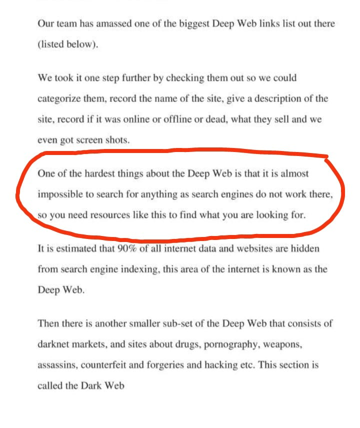

---

## Our Solution

This Proof of Concept (PoC) efficiently enumerates .onion URLs of active hidden servers on TOR. By leveraging cryptographic security controls and search engine scraping techniques, it helps identify and catalog active hidden services.

---

## Installation

### For Linux
```sh
git clone https://github.com/anshugautam23/SIH_TORNET.git
cd SIH_TORNET
pip install -r requirements.txt
sudo apt install tor exiftool
sudo service tor start
# or
sudo systemctl start tor
```

### For Windows
```sh
git clone https://github.com/anshugautam23/SIH_TORNET.git
cd SIH_TORNET
pip install -r requirements.txt
```
Download and install:
- [TOR](https://www.torproject.org/download/tor/)
- [EXIFtool](https://github.com/exiftool/exiftool.git)

---

## Overview

### Authentication
- Login only (no signup). Contact admin to be added as a user.
- Default admin credentials: `admin:admin`
- Five main functionalities:
  1. Discover Onion URLs
  2. Validate Onion URLs
  3. Render DOM of Onion URLs
  4. Enumerate Onion URLs
  5. Schedule Tasks

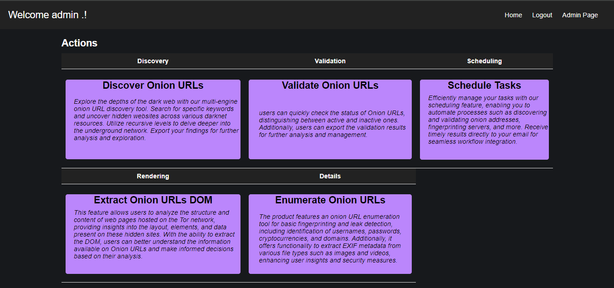

#### 1. Discover Onion URLs
- Discover URLs based on keywords and recursion level.
- Export results and render DOM of discovered URLs.

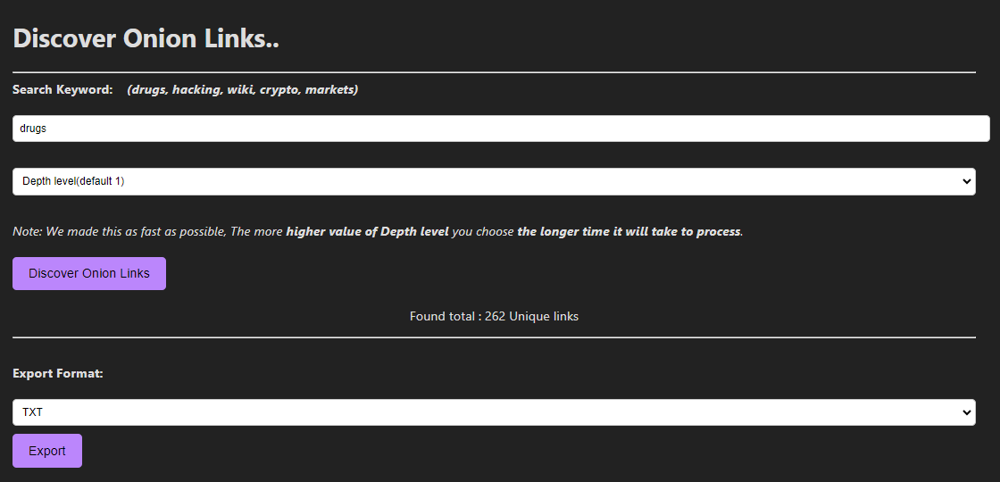

#### 2. Validate Onion URLs
- Check if onion URLs are alive (single or bulk via `.txt` file).
- Export results.

#### 3. Extract DOM of Onion URLs
- Render the DOM (source) of any onion URL.

#### 4. Enumerate Onion URLs
- Use regex to find usernames, passwords, crypto addresses, domain names, etc.
- Analyze EXIF metadata of images/media files.

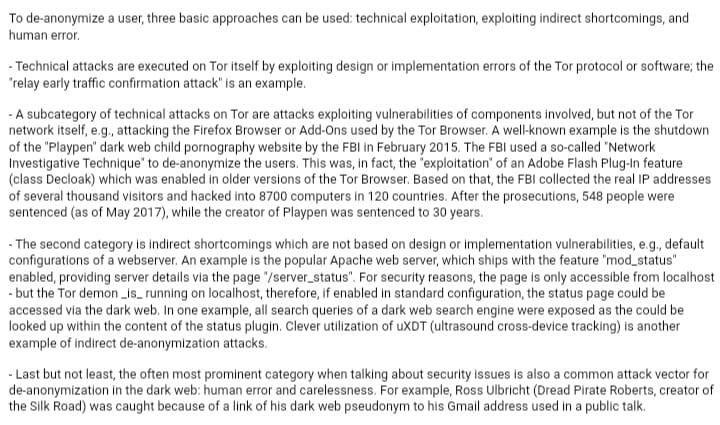

#### 5. Schedule Tasks
- Schedule tasks for future date/time. Results sent via SMTP email.
- Currently supports "Discover Onion URLs" (more features can be added).

---

## Admin Functionality
- View all users (username, password (SHA-256), API key, secret-access key)
- Add, update, or delete users
- Only admin can access the admin portal
- Default admin credentials: `admin:admin`

---

## Core Concepts

### Tech Stack
- Python
- HTML, CSS
- SQLite 3
- Flask
- ExifTool
- TOR Daemon

### Authentication & Authorization
- Only admin can add users
- Default admin user: `admin:admin`
- Only admin can access the admin portal

---

## Features

### 1. Discover Onion URLs
- Scrape popular dark web search engines for unique onion URLs by keyword and depth.
- Export results in TXT, JSON, or PDF.

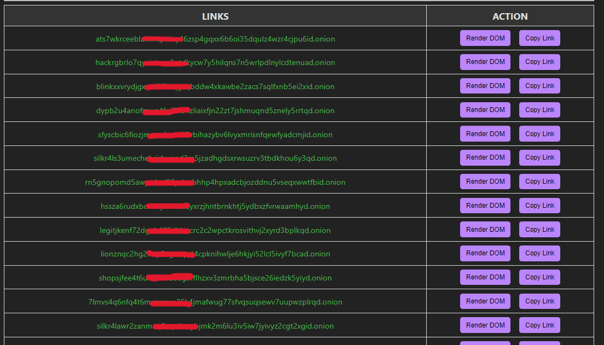

### 2. Validate Onion URLs
- Validate if onion URLs are alive (single or bulk).

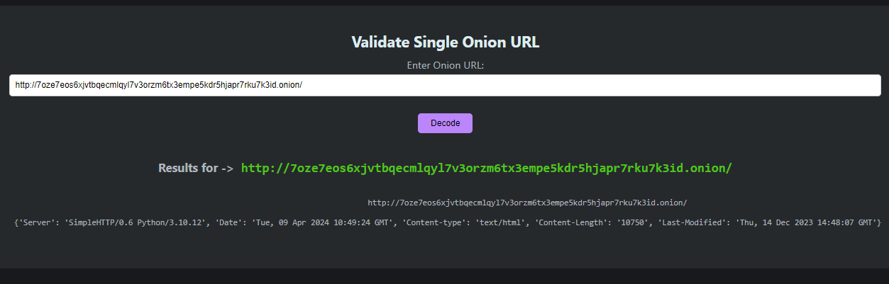
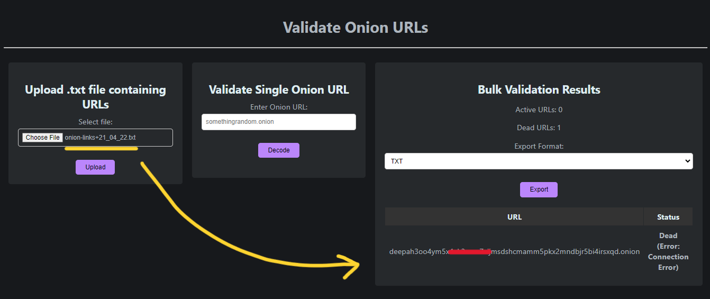

### 3. Extract DOM of Onion URLs
- Provide an onion address to get its DOM.

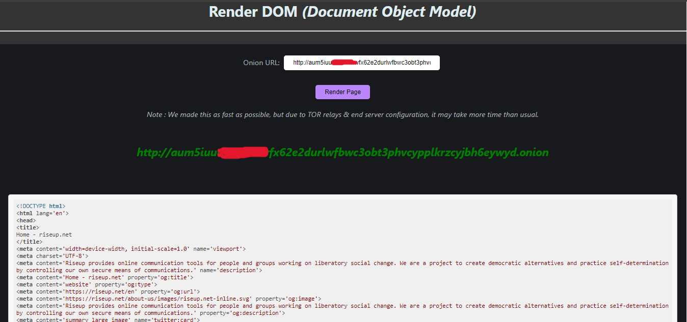

### 4. Enumerate Onion URLs
- Use regex to find sensitive info and server config leaks.
- Fuzz for exposed server configuration files.

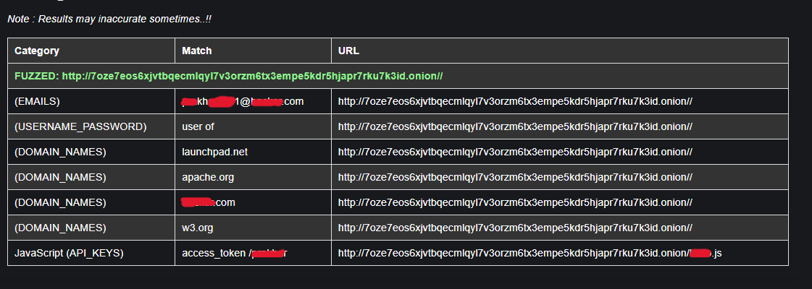
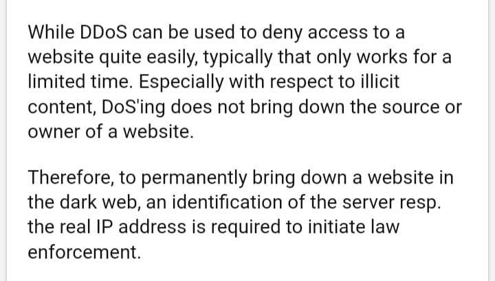
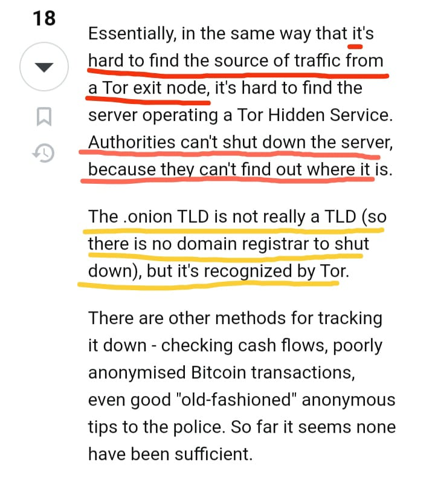
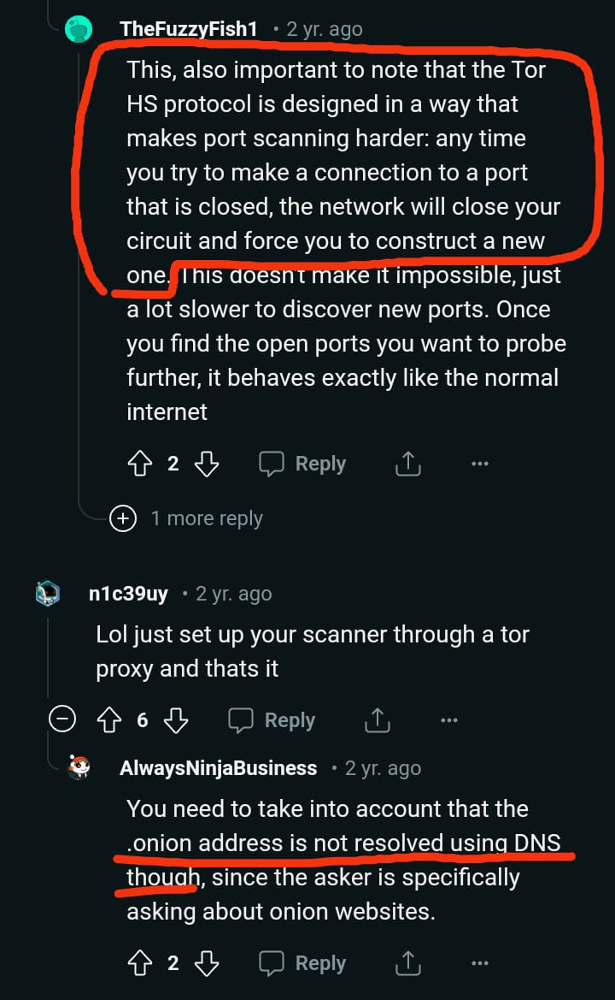
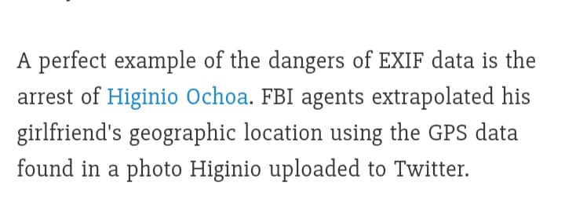
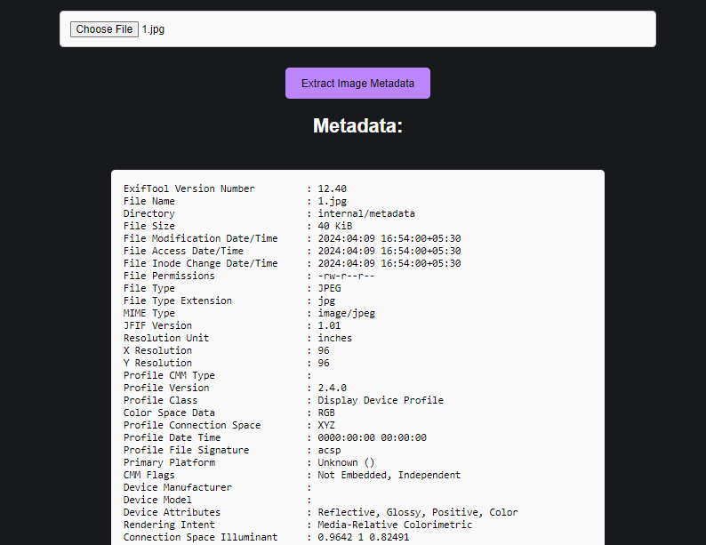

### 5. Schedule Tasks
- Automate tasks and receive results via email.
- Set up Gmail and app password in `config.txt` for notifications.
- [Create Gmail App Password](https://support.google.com/accounts/answer/185833)

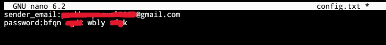

---

## Contribution

We welcome contributions! You can:
- Address open issues or add features (fork, branch, PR)
- Report bugs (with steps and logs)
- Improve documentation
- Test and provide feedback

---

## Resources
- [Using Python to Monitor Darkweb](https://www.digitalforensicstips.com/2023/01/using-python-to-monitor-onion-dark-web.html)
- [Darkweb Scraping Using Python](https://hoxframework.com.hr/?p=473)
- [Is TOR Still Anonymous?](https://youtu.be/-uDYvy2jQzM?si=UrVGUBlkLLikg9VP)
- [Edward Snowden Research](https://www.theguardian.com/world/interactive/2013/oct/04/tor-stinks-nsa-presentation-document)
- [DEFCON-22: How People Got Caught](https://youtu.be/eQ2OZKitRwc?si=P1gPeP9lVDg9g6Fs)
- [DEFCON-22: Touring the Darkside of the Internet](https://youtu.be/To5yarfAg_E?si=Ek9lqNOYeLy-cCbb)
- [Bad OPSEC: How TOR Users Got Caught](https://youtu.be/GR_U0G-QGA0?si=UaX2Fp_vW1faqTrl)
- [Deanonymization of TOR HTTP Hidden Services](https://www.youtube.com/watch?v=v45_tkKCJ54)
- [Uncovering Tor Hidden Service with Etag](https://sh1ttykids.medium.com/new-techniques-uncovering-tor-hidden-service-with-etag-5249044a0e9d)

---